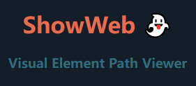

# ShowWeb👻: Visual Element Path Viewer Browser Extension
# 浏览器插件👻：可视化元素路径查看器【谷歌 & Edge】

    
    
    

## Description:
轻松了解网页上的元素结构！这款插件允许你通过按住Alt键并点击页面上的任何元素，立即可视化查看该元素的DOM路径。无需繁琐的开发者工具，一键获取元素信息，包括标签名、类名、ID等。另外，提供了方便的弹出框，展示了元素的路径和内容，让你更直观地理解和调试页面结构。

Explore the structure of your webpage effortlessly! This plugin allows you to visualize the DOM path of any element by holding down the Alt key and clicking on it. No need for cumbersome developer tools—get instant access to element information, including tag names, class names, IDs, and more. Additionally, it provides a convenient popup box displaying the element's path and content, making it easier for you to understand and debug page structures.

## Key Features:
- **快速查看元素路径：** 按住Alt键，点击任意页面元素，即可获取其DOM路径。

- **可视化弹出框：** 以清晰的方式展示元素路径和内容，方便开发者快速定位和调试。

- **简洁实用：** 无需打开开发者工具，快速获取页面元素信息。

---

- **Quick Element Path Inspection:** Hold down the Alt key, click on any page element, and instantly retrieve its DOM path.

- **Visual Popup Box: Clearly** showcases element paths and content, facilitating developers in quick location and debugging.

- **Simplicity at its Best:** No need to open developer tools—swiftly obtain page element information.

## How to Use:
1. 激活插件：按住Alt键，并点击页面上的任何元素。
2. 查看信息：弹出框将显示元素的DOM路径和内容。

>注意： 插件会在Alt键未按下时保持静默，不会干扰正常的浏览体验。
---
1. Activate the plugin: Hold down the **Alt + click** on any webpage element.
2. View Information: The popup box will display the DOM path and content of the selected element.

>Note: The plugin remains silent when the Alt key is not pressed, ensuring a seamless browsing experience.

## To-Do List
- [ ]  添加console界面 Add console interface

